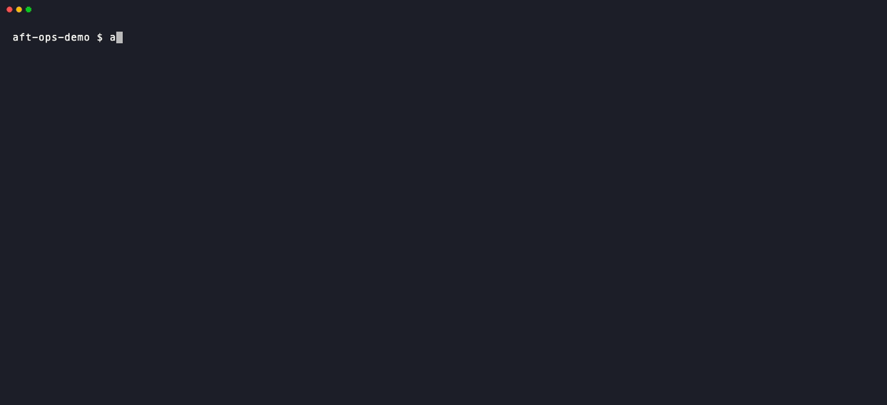
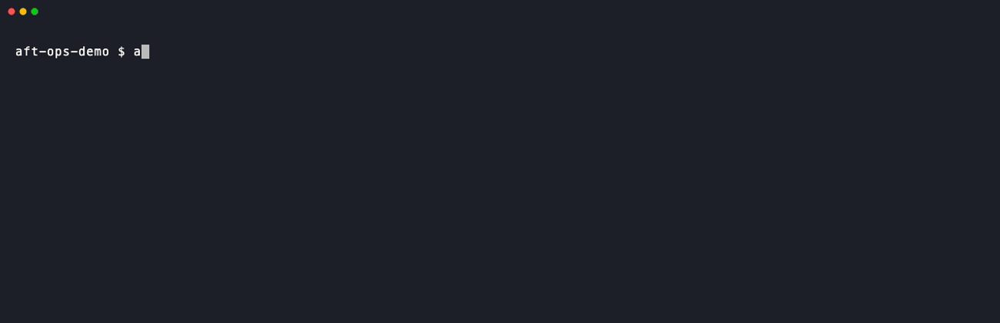

# AFT Operations Toolkit (`aft-ops`)

Operate [AWS Control Tower Account Factory for Terraform (AFT)](https://github.com/aws-ia/terraform-aws-control_tower_account_factory)
resources at scale from the command line: check hundreds of per-account
customizations pipelines at a glance, find where they fail, and trigger
Release changes — with rate-limit-aware batching, caching, and both a
scriptable CLI and an interactive TUI.

> Status: early development. See [docs/requirements.md](docs/requirements.md)
> and [docs/design.md](docs/design.md).

## Demo

Every recording below runs against a local fixture — no AWS account, no
credentials, no network. You can reproduce any of them with
`aft-ops --demo docs/demo/fixture.json` (see [docs/demo](docs/demo)).

**Triage from the command line** — every account pipeline at a glance, filter
to what is broken, and get the terraform error out of a 200-line CodeBuild log
without opening the console:


**Drill down in the TUI** — pipeline list → executions → actions → log, with
each build's terraform verdict fetched lazily and the CodeBuild noise stripped
out of the log:


**Release change on many pipelines at once** — `space` to select, `x` to
confirm against freshly refetched status, then the list polls the released
rows until nothing is running:



**Watch what is still going** — `--watch` refetches only the rows that can
still change, and says how many that was:



## Install

```bash
brew install hacker65536/tap/aft-ops
```

Or grab a binary from the [releases page](https://github.com/hacker65536/aft-ops/releases),
or build from source:

```bash
go install github.com/hacker65536/aft-ops/cmd/aft-ops@latest
```

## Quick start

```bash
go build -o aft-ops ./cmd/aft-ops

# try it without an AWS account: everything below works against a fixture
./aft-ops --demo docs/demo/fixture.json

# interactive TUI
./aft-ops

# list all account pipelines with their latest status
./aft-ops pipeline list

# failed ones only, as JSON (stable schema for automation / AI agents)
./aft-ops pipeline list --status Failed -o json

# keep watching while something is running
./aft-ops pipeline list --watch --interval 30s

# drill into one pipeline
./aft-ops pipeline show my-account
./aft-ops pipeline executions my-account --actions
./aft-ops pipeline logs my-account --execution <execution-id> --summary

# re-release everything that failed (dry-run first)
./aft-ops pipeline release --status Failed --dry-run
./aft-ops pipeline release --status Failed

# release a group on purpose, and refuse to run if it is not the size you expect
./aft-ops pipeline release --account payments --expect 3 --yes

# analyze API call rates / throttling from recorded metrics
./aft-ops metrics show
```

Every command that talks to AWS first prints the target it resolved to, so a
stray `AWS_PROFILE` can never send an operation to the wrong account:

```
aws: account 123456789012 · region ap-northeast-1 · profile my-aft-management-profile
```

## TUI

`aft-ops tui` follows the CodePipeline data model down four screens:

```
Pipeline list ──▶ Executions ──▶ Actions ──▶ Log
```

- vim-style navigation: `h` back · `l`/`enter` drill in · `j`/`k` move · `g`/`G` top/bottom.
  A header dots indicator (`••••`) shows the current depth
- `v` from any level jumps straight to the most relevant log — the failed
  action's, else the last build's
- Log view renders the terraform portion by default (`m` cycles
  terraform / raw / summary) and supports less-style search: `/` to search,
  `n`/`N` for next/previous match
- Actions show each action's terraform verdict (`Apply complete! ...` /
  `Error: ...`) fetched lazily from its build log, with plan-colored counts
- `space` multi-select + `x` triggers batch Release change (guarded by
  `release.max_targets`); the confirm screen re-checks the targets' current
  status before you commit
- While any pipeline is running, the list auto-refreshes just those rows every
  `tui.poll_interval` (default 30s, `0` disables it) and stops once everything
  is terminal
- Immutable data (completed builds' logs, finished executions' actions) is
  cached in-session; execution history is served within
  `cache.executions_ttl` (default 15m) — `r`/`R` force a refresh

## Configuration

`~/.config/aft-ops/config.yaml` (all keys optional; flags > `AFT_OPS_*` env > file > defaults):

Every key can be set from the environment, and the variable's name is derived
from the key's path — `AFT_OPS_` plus the path in upper snake case, so
`cache.status_ttl` is `AFT_OPS_CACHE_STATUS_TTL` and `profile` is
`AFT_OPS_PROFILE`. There is no list to consult and no key left out. A value
that does not parse stops the run rather than being ignored.

```yaml
profile: my-aft-management-profile
region: ap-northeast-1
account_source: aft-dynamodb   # aft-dynamodb | organizations | static

# Profile used for Release change and other writes. Unset means writes use
# `profile`. It is meant for a different role in the *same* account (read-only
# for browsing, administrator for releasing): a run operates on one account,
# and a write profile resolving elsewhere is refused before anything starts.
# `--profile` moves the read side only — pass `--write-profile` to move both.
write_profile: my-aft-management-admin-profile

# Which shared config file `profile` is looked up in. Unset (the default)
# leaves this to the SDK: $AWS_CONFIG_FILE if set, otherwise ~/.aws/config.
# Set it when you keep one config file per AWS organization — it ties the
# profile to the file that defines it, so switching shells cannot leave a
# configured profile pointing at a file that never had it.
# A value here (or --aws-config-file) overrides $AWS_CONFIG_FILE.
aws_config_file: ~/.aws/config-sandbox

batch:
  concurrency: 10
  rps: 8

cache:
  status_ttl: 10m        # latest-status cache; 0 = always fan out
  executions_ttl: 15m    # in-session execution-history memo

release:
  max_targets: 50
  skip_in_progress: true

tui:
  poll_interval: 30s     # auto-refresh of running pipelines (also --watch's default)
```

### Choosing what to act on

A target names one pipeline exactly — by pipeline name, account id, or account
name. Substrings do not resolve: `payments` is refused (with the three real
names listed) rather than quietly standing for `payments-prod`, `payments-stg`
and `payments-dev`. A fragment that identifies one pipeline today identifies
three after the next account is vended, and a command line kept in a runbook
or a CI job should say how many pipelines it acts on.

Acting on a group is asked for explicitly:

```bash
./aft-ops pipeline release --account payments   # every account matching the substring
./aft-ops pipeline release --status Failed      # every pipeline in that state
./aft-ops pipeline release --file targets.txt   # an explicit list, one exact name per line
```

`--account` and `--status` intersect, as they do in `pipeline list`; targets
named individually are added on top. For unattended runs, `--expect N` fails
unless the selection resolves to exactly N pipelines — `max_targets` caps the
blast radius, `--expect` pins it to what the automation was written for.

Release operations never trust the status cache: `--status` refetches the
whole inventory before deciding what to release, and named targets and
`--account` groups are refetched individually, so neither the selection nor
the in-progress skip is made on minutes-old data.

## Permissions

Everything runs against the AFT management account, and the split the tool
asks for is the one worth having: browsing is read-only, and the only thing it
ever writes is `codepipeline:StartPipelineExecution`.

AFT's own roles are not a fit for this. The `aft-*` roles it creates are
service roles trusted by CodePipeline, CodeBuild, Lambda and Step Functions, so
no operator can assume them; `AWSAFTAdmin` can only assume two other roles and
holds no service permissions of its own; and `AWSAFTExecution` / `AWSAFTService`
carry `AdministratorAccess` and are the identity AFT's own automation runs as —
borrowing them buys no least privilege and mixes your actions with the
framework's in CloudTrail. Grant the two below instead.

### Reading

`ReadOnlyAccess` covers it. To grant exactly what is used:

| Service | Actions |
|---|---|
| CodePipeline | `ListPipelines`, `GetPipelineState`, `ListPipelineExecutions`, `ListActionExecutions` |
| CodeBuild | `BatchGetBuilds` |
| CloudWatch Logs | `GetLogEvents` |
| DynamoDB | `Scan` on `aft-request-metadata` (with `account_source: aft-dynamodb`) |
| Organizations | `ListAccounts` (with `account_source: organizations`) |
| STS | `GetCallerIdentity` |

`sts:GetCallerIdentity` is not optional: every run resolves and prints the
account it is about to act on, and a write is refused unless it lands in that
same account.

### Releasing

One API, so the policy is small:

```json
{
  "Version": "2012-10-17",
  "Statement": [
    {
      "Sid": "ReleaseChangeOnCustomizationsPipelines",
      "Effect": "Allow",
      "Action": "codepipeline:StartPipelineExecution",
      "Resource": "arn:aws:codepipeline:ap-northeast-1:123456789012:*-customizations-pipeline"
    },
    { "Effect": "Allow", "Action": "sts:GetCallerIdentity", "Resource": "*" }
  ]
}
```

The resource pattern is deliberate: it leaves out AFT's own two pipelines
(`aft-account-request` and `aft-account-provisioning-customizations`), which
this tool never targets anyway. No KMS grant is needed — the pipeline's
artifact key is used by the pipeline, not by the caller starting it.

Point `write_profile` at a role holding that policy and `profile` at the
read-only one. The two must resolve to the same account; a write profile that
lands anywhere else is refused before the confirmation prompt.

## License

[MIT](LICENSE)
